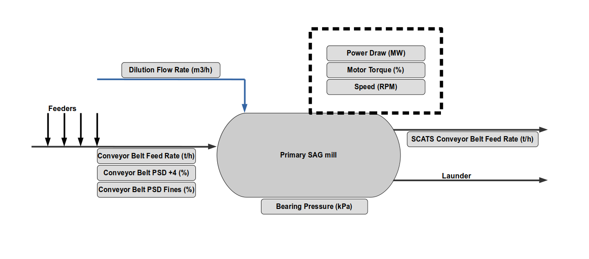
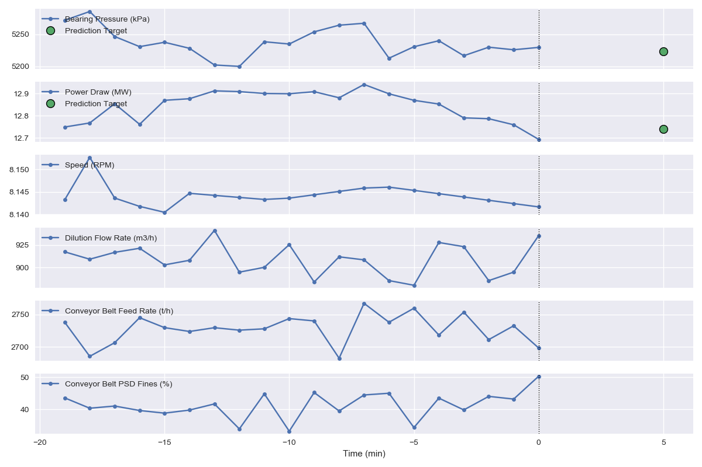

# Intellisense.io Test Project

This repository contains instructions and data for a test project for the
Intellisense.io Data Science team.

## Overview

The goal of the project is to devise and implement a prototype data-driven
prediction model of a Semi-autogenous (SAG) Mill.

## Background

Semi-autogenous (SAG) mills are central pieces of equipment for large mining
operations. They are commonly used in the secondary crushing stage to break
down larger rocks from the pit for further processing. As a very rough analogy,
a SAG mill works like a giant washing machine for rocks and steel balls. For
a quick introduction to the working principle, we have compiled some videos in
[this playlist](https://www.youtube.com/playlist?list=PLChAfAeM2Zma_5SHfw5jrT0KQAY2z0ne8).

This project involves the optimization of a SAG mill using real-time data from
their distributed control system. The broader target for model development
here, in a nutshell, is to maximize material throughput while minimizing power
draw. In this project, you will be tackling a first requirement for this
optimizer: a prediction model. Since detailed physical simulations as shown
in the videos linked are computationally too expensive and many of the inputs
are unknown, we are looking for alternative methods to make predictions, based
on the recorded data.

## Environment

The immediate environment of the SAG mill is shown below. A set of six feeders
(small conveyors) transfer the material onto the main conveyor belt. Water
dilution is added when the material is fed into the SAG mill, and steel balls
are added periodically as additional grinding medium. Inside the mill, the
material breaks down due to impacts and grinding. The material is screened by
size using metal grates, and material that is small enough can exit the mill to
the right. After the mill, the material is separated by size: The larger
particles (pebbles) are fed into the pebble crusher as additional grinding
stage (not shown in the figure), and the smaller particles are fed to cyclone
that separates them further into fine product for flotation and coarse product
for additional grinding.

## Activities to be performed

-   Become familiar with the basic working principle of a SAG mill
-   Become familiar with the provided data
-   Select a model to predict performance variables 5 minutes in advance
-   Implement a prototype of this model to generate results
-   Use the test data to calculate prediction error statistics and compare them to the baseline provided in `baseline.ipynb`
-   Present your model and results to the team

## Project Output

-   Short summary of the approach, decisions, and steps taken
-   Predictor prototype code
-   Error statistics and result visualization

We recommend to use a Jupyter notebook to combine the code and plots with markdown cells to jot down any thoughts along the way. Understanding your thought process is in general at least as important to us as the numeric results.

## Data overview

IntelliSense.io provides roughly four months of data based on real measurements
from a client SAG mill. Types of data tracked include performance variables,
which are used to monitor the operation of the mill (and can be considered
outputs); feed variables, which are outside of the control of the operator; and
control variables, which can be controlled by the operator. The following data
is available:

-   Performance variables
    -   Power Draw (MW) — Power drawn by the mill motor
    -   Bearing Pressure (kPa) — Pressure on the mill supports. Can be
        thought of as the weight of the mill.
-   Control variables
    -   Speed (RPM) — Rotation speed of the mill
    -   Conveyor Belt Feed Rate (t/h) — Mass flow rate of material into the
        mill
    -   Dilution Flow Rate (m³/h) — Volume flow rate of water into the mill
-   Feed variables
    -   Conveyor Belt Fines (%) — Percent of material in the feed
        classified as "fine"

## Hints

- Depending on your modelling method, you may want to apply some preprocessing to the data (make sure that time consistency is preserved if you choose to remove full rows of data)
- Use the data from all the variables as your model inputs
- Try using the last 5 to 20 minutes of data as model inputs
- The targets for the predictions are the two performance variables at 5 minutes into the future
- See plot below for an example prediction setup using 20 minutes of history inputs (blue) and predicting the two marked points (green)

